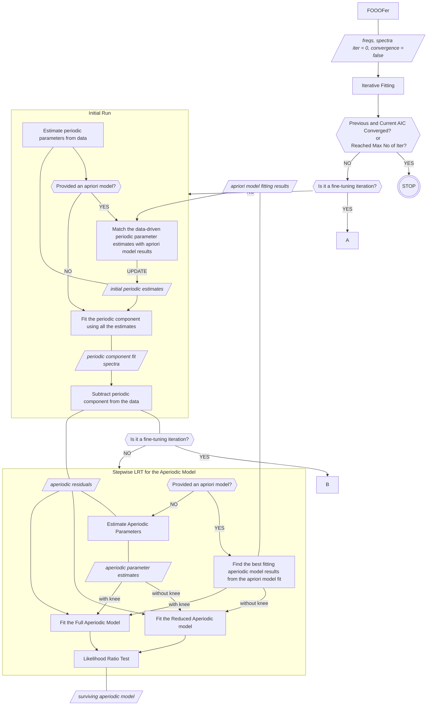

# Algorithm Flow Chart

```mermaid
flowchart TB
    Class[FOOOFer]--- MainInp@{shape: lean-r, label: "*freqs, spectra <br> iter = 0, convergence = false*"}
    MainInp --> Main[Iterative Fitting]
    Main --> ConvCheck@{shape: hex, label: "Previous and Current AIC Converged? <br> or <br> Reached Max No of Iter?"}
    ConvCheck --> |YES| STOP@{ shape: dbl-circ}
    ConvCheck --> |NO| RefCheck@{shape: hex, label: "Is it a fine-tuning iteration?"}
    
    RefCheck --> |YES| A
    RefCheck --> |NO| InitRun
    AprioriModelInp@{shape: lean-r, label: "*apriori model fitting results*"} --> PEstSynch
    subgraph InitRun[Initial Run]
        direction TB
        PEst[Estimate periodic parameters from data]
        PEst --> AprioriPModelCheck@{shape: hex, label: "Provided an apriori model?"}
        PEst --- PInitFitInp@{shape: lean-r, label: "*initial periodic estimates*"}
        AprioriPModelCheck --> |YES| PEstSynch[Match the data-driven periodic parameter estimates with apriori model results]
        
        AprioriPModelCheck --> |NO| PInitFit[Fit the periodic component using all the estimates]
        
        PEstSynch --> |UPDATE| PInitFitInp
        PInitFitInp --> PInitFit
        PInitFit --- ApCompEstInp@{shape: lean-r, label: "*periodic component fit <br> spectra*"}
        ApCompEstInp --> ApCompEst[Subtract periodic component from the data]        
        
    end

    ApCompEst --- RefCheck2@{shape: hex, label: "Is it a fine-tuning iteration?"}
    ApCompEst --- ApEstInp@{shape: lean-r, label: "*aperiodic residuals*"}
    RefCheck2 --> |YES| B
    RefCheck2 --> |NO| ApLRTRun

    AprioriModelInp --- ApApEst
    subgraph ApLRTRun[Stepwise LRT for the Aperiodic Model]
        direction TB
        AprioriApModelCheck@{shape: hex, label: "Provided an apriori model?"} --> |YES|ApApEst["Find the best fitting aperiodic model results from the apriori model fit"]
        AprioriApModelCheck --> |NO| ApEst[Estimate Aperiodic Parameters]
        ApEstInp --- ApEst
        ApEst --- ApFitInp@{shape: lean-r, label: "*aperiodic parameter estimates*"}
        ApFitInp & ApApEst --> |without knee| ApFit[Fit the Reduced Aperiodic model]
        ApEstInp --> ApFit & ApFitKnee
        ApFitInp & ApApEst --> |with knee|ApFitKnee[Fit the Full Aperiodic Model]
        ApFit & ApFitKnee --> ApLRT["Likelihood Ratio Test"]
    end
    ApLRT --- SurvivingApModel@{shape: lean-r, label: "*surviving aperiodic model*"}
    
    
    %%{
    ApEst --> |initial aperiodic estimates without knee| ApFit[Fit the Reduced Aperiodic model]
    ApEst --> |initial aperiodic estimates with knee| ApFitKnee[Fit the Full Aperiodic Model]
    ApFit & ApFitKnee --> ApLRT[Likelihood Ratio Test]
    ApLRT --> |surviving_aperiodic_model| PRes[1. Subtract aperiodic component fit from the spectra <br> 2. Calculate the aperiodic model AIC]
    PRes --> |"initial periodic estimates<br>previous_aic = aperiodic_aic<br>test_peak = most prominent peak <br> surviving_peaks = [ ]<br>surviving_periodic_model = surviving_aperiodic_model" |FwdLRT

    subgraph FwdLRT[Forward LRT for Periodic Model]
        direction TB
        PFit[Fit the periodic model with the surviving peaks and the test peak] --> PStepLRT["1. Calculate the current model AIC with total no of periodic and aperiodic params <br>2. Likelihood Ratio Test (previous aic versus current aic)"]
        PStepLRT --> |"significant improvement"| SurvivingPeaks(Append to surviving_peaks <br> surviving_periodic_model = curr_periodic_model <br> final_model_aic = curr_aic)
        SurvivingPeaks --> PStepCheck([Are there more peaks to test?])
        PStepLRT --> |"no significant improvement"|PStepCheck
        
        PStepCheck --> |YES<br>surviving_peaks<br>test_peak = next prominent peak| PFit
    end
    PStepCheck -.-> |NO<br>surviving periodic model & final_model_aic| Update


    Update[Update for Next Iter<br>1. If iter > 1] --> |aperiodic residuals <br> parameter results| Start
    Update --> |Full model AIC| ConvCheck 
    }%%
```